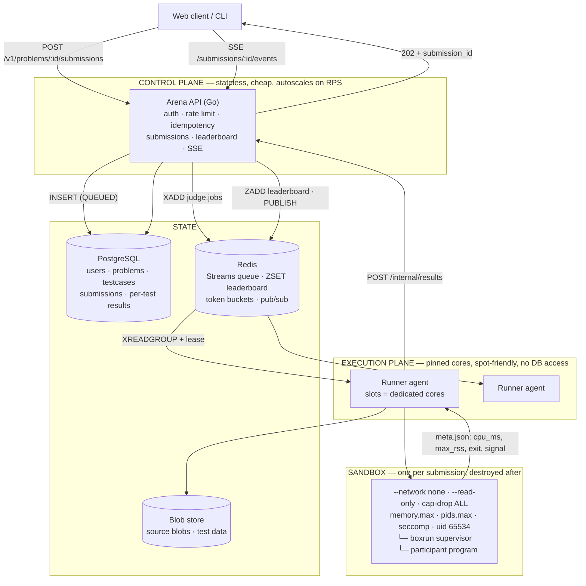
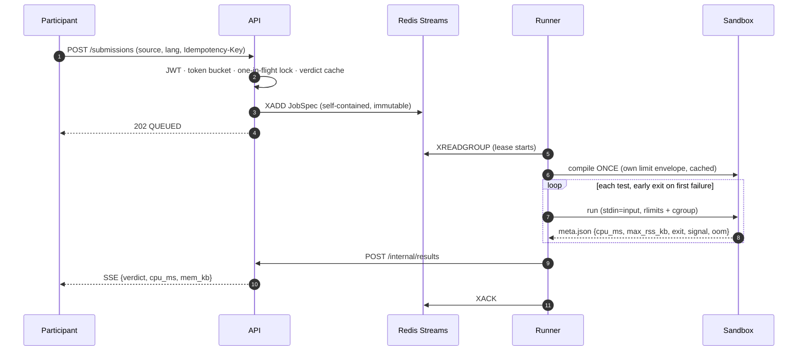
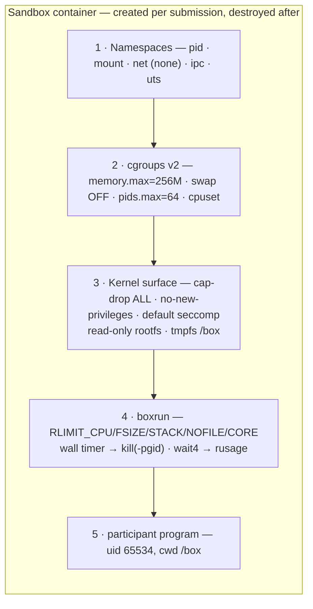
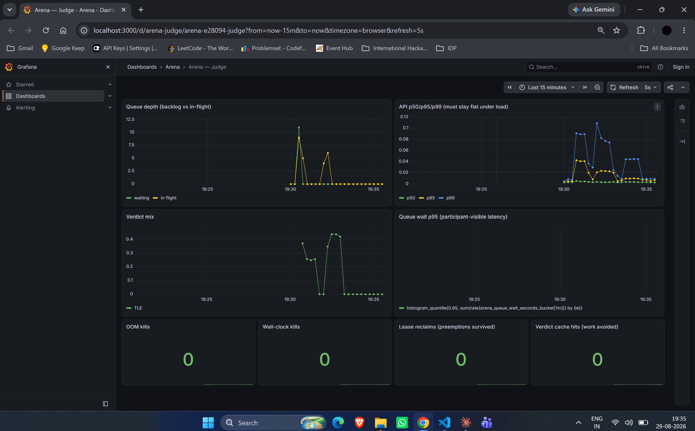
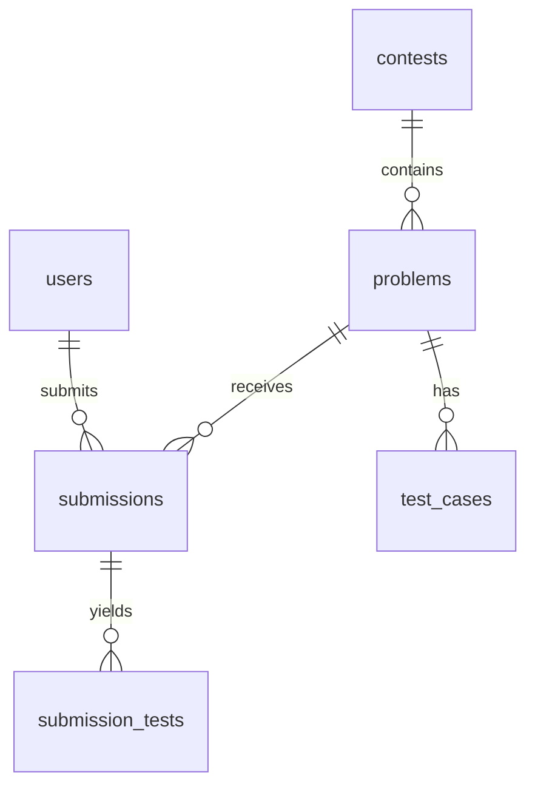

# Arena

**A deterministic, sandboxed remote runtime environment for competitive programming contests.**

Submit source code; Arena compiles it, runs it against hidden tests inside a hardened
sandbox, measures CPU time and peak memory deterministically, assigns a verdict, and ranks
participants on a live leaderboard.

Built for **GDG VIT Chennai — Cloud & DevOps Round 2, Task 2 (Remote Runtime Environment).**


| | |
|---|---|
| **Live demo** | <http://34.93.124.207:8080> |
| **Health** | <http://34.93.124.207:8080/readyz> |
| **Problems** | <http://34.93.124.207:8080/v1/contests/technovit-speed/problems> |
| **Leaderboard** | <http://34.93.124.207:8080/v1/contests/technovit-speed/leaderboard> |
| **Metrics** | <http://34.93.124.207:8080/metrics> |
| **Demo video** | [5-minute walkthrough](https://drive.google.com/file/d/1knx3zIm1B9f28S8MNgHsSLOj5Mzvl_xI/view?usp=sharing) |
| **Login** | `anish` / `password123` |

> The demo instance is a single Google Compute Engine VM served over **plain HTTP** — there
> is no domain, so there is no certificate. The Caddy TLS overlay
> (`deploy/docker-compose.prod.yml`) is written and needs only a hostname. The instance runs
> until **10 September 2026**; after that the whole stack is reproducible with `docker compose up` from
> a clean clone.

**Status:** phases 0–9 complete. `make smoke` **11/11**, golden judge-the-judge suite
**18/19**, `go test ./... -race` green, architecture rules enforced in CI, load-tested to a
**7,371-job backlog** with submission p95 at **27.4 ms** and zero 5xx. Known gaps are in
§17 — none of them are silent.

---

## Quick start

```bash
git clone https://github.com/AnishPrakash/arena.git && cd arena
cp .env.example .env
sudo mkdir -p /var/tmp/arena-blobs && sudo chmod 0777 /var/tmp/arena-blobs
make images                                          # language sandbox images
docker compose -f deploy/docker-compose.yml up -d
docker compose -f deploy/docker-compose.yml run --rm seed
./scripts/smoke.sh                                   # 11-case verdict matrix, end to end
```

Requires Linux (or WSL2) with **cgroups v2**, Docker, and Go 1.25+. `make help` lists every
target.

| | |
|---|---|
| API | <http://localhost:8080/v1/contests/technovit-speed/problems> |
| Metrics | <http://localhost:8080/metrics> |
| Grafana | <http://localhost:3000> → dashboard **Arena — Judge** |

---

## 1. The problem, and the one decision that shapes everything

A contest judge has two workloads with nothing in common:

- **Accepting submissions** — thousands of tiny requests in a 30-second burst at contest
  start. Cheap, latency-critical, trivially horizontal.
- **Executing untrusted code** — seconds of pinned CPU per submission, hostile input, hard
  to isolate, expensive.

Running them in the same process makes your HTTP worker pool *become* your execution
capacity. At contest start every request blocks for seconds, the pool saturates, clients
time out on submissions that actually ran, and nobody can tell a participant what happened
to their code.

**Arena separates the control plane from the execution plane with a durable queue between
them, and never executes code inside an HTTP request.**

A submission burst becomes *queue depth* — an observable number that drives autoscaling —
instead of dropped requests. The API answers in tens of milliseconds regardless of how deep
the judging backlog is; §6 has the measurement. Runner capacity scales on its own signal, on
its own hardware, at its own cost.

Every other decision in this document follows from that one.

---

## 2. Architecture



**Trust boundary.** Runner nodes hold **no database credentials**. They reach Redis, the
blob store (read-only), and one token-authenticated endpoint. A sandbox escape lands
somewhere that cannot touch participant data. Under Kubernetes a `NetworkPolicy`
additionally blocks egress to Postgres and to `169.254.169.254` (cloud metadata / IAM
credentials).

### Submission lifecycle



If the runner dies anywhere between `XREADGROUP` and `XACK`, the message stays in the
Pending Entries List and another runner reclaims it once the lease expires. Results are
written under a `WHERE status <> 'DONE'` guard, so at-least-once delivery becomes
**effectively-once**.

---

## 3. The sandbox



Each layer assumes the one above it has been bypassed. A seccomp bypass still faces cgroups;
a cgroup bug still faces the wall timer; a hung supervisor still faces the queue lease.

### `boxrun` — the in-sandbox supervisor

Docker enforces cgroups but gives no *per-process* accounting. `docker stats` samples
asynchronously and reports the container, not the program. So Arena ships a ~320-line static
Go binary into every language image. It is PID 1 in the sandbox: it applies rlimits, execs
the participant's program, kills the whole **process group** on a wall deadline, and reports
exact usage from `wait4(2)`.

One binary serves every language. Adding Rust adds no supervisor code.

Because Go's runtime is multi-threaded, there is no safe hook between `fork` and `exec`.
`boxrun` therefore re-execs itself with a `--stage2` marker; stage 2 applies `setrlimit` to
itself (limits survive `exec`) and then `syscall.Exec`s the target, while the parent does
`wait4` for `rusage`.

### The five limit decisions that are easy to get wrong

1. **`--memory-swap` must equal `--memory`.** Docker's default is `2 × memory` of swap, so a
   leaking program swaps instead of OOMing: a clean `MLE` degrades into a 60-second wall
   timeout that also thrashes every other submission on the node.
2. **cgroup memory, not `RLIMIT_AS`.** The JVM and Node reserve huge *virtual* address space
   at startup; an address-space limit fails them spuriously. cgroups measure RSS.
3. **Both a CPU limit and a wall limit.** `RLIMIT_CPU` never fires for `sleep(600)` or a
   blocked read — they burn no CPU. A wall timer alone cannot tell a busy loop from a slow
   solution on a noisy node. Arena uses `wall = 3 × cpu`, plus the queue lease as the outer
   backstop for a dead runner. **Three independent timers, three different failure modes.**
4. **Cap stdout.** `while True: print("x")` fills the disk and the log pipeline in seconds.
   `RLIMIT_FSIZE` turns it into a clean `OLE`.
5. **Compilation gets its own, much larger envelope.** g++ with heavy templates legitimately
   needs hundreds of megabytes, and `RLIMIT_FSIZE` bounds *every* file a process writes — so
   a run-sized limit kills the linker while it writes the output binary. §13 has the story.

### On seccomp — a deliberate non-decision

Docker applies a curated seccomp **whitelist** by default, blocking ~44 syscalls including
`ptrace`, `mount`, `pivot_root`, `bpf` and `kexec_load`. Passing a custom profile *replaces*
it rather than adding to it, so a hand-written denylist (`defaultAction: SCMP_ACT_ALLOW`
plus a few `ERRNO` entries) would be strictly **weaker** while looking more rigorous. Arena
keeps the stronger default and layers `cap-drop=ALL`, `no-new-privileges`, a non-root uid and
a read-only rootfs on top. The documented upgrade is gVisor (`--runtime=runsc`), one config
value behind the `Sandbox` interface.

---

## 4. The four disruption classes the brief names

| Disruption | Mechanism | Where |
|---|---|---|
| **Infinite loop** | `RLIMIT_CPU` (soft `SIGXCPU` + hard `SIGKILL`, so a signal handler cannot survive it) | `cmd/boxrun` |
| **Blocked / sleeping forever** | wall-clock watchdog → `kill(-pgid, SIGKILL)` — reaps forked children too | `cmd/boxrun` |
| **Process preemption** | Redis Streams lease + `XAUTOCLAIM` redelivery; `SIGTERM` nacks in-flight work | `internal/adapters/redisq` |
| **Lost queue message** | reconciler re-enqueues stuck rows, then fails honestly as `IE` | `internal/api/reconciler.go` |
| **Memory overflow** | cgroup `memory.max`, swap disabled; `OOMKilled` read from the cgroup, never guessed from the exit code | `internal/adapters/sandbox` |
| **Memory leak** | structurally impossible — sandboxes are ephemeral; the runner streams output to disk and never buffers it | by construction |
| **Fork bomb** | `--pids-limit=64` | `internal/adapters/sandbox` |
| **Output flood** | `RLIMIT_FSIZE` → `SIGXFSZ` → `OLE` | `cmd/boxrun` |
| **Poison pill** | delivery-count dead-lettering after `ARENA_MAX_ATTEMPTS` | `internal/adapters/redisq` |

### Verdict precedence — and why the order matters

```
IE > CE > OLE > MLE > TLE > RE > WA > AC
```

An OOM-killed process **also** exits non-zero and dies on `SIGKILL`. Checking the exit code
first reports `RE` for every `MLE` — the classic wrong-verdict bug that makes participants
stop trusting a judge. Likewise a program killed by `SIGXFSZ` would otherwise read as `RE`.
`core.ClassifyRun` encodes this order, is pure, and is exhaustively table-tested.

The **submission** verdict is the first non-`AC` test in *index* order (participants expect
"failed on test 7"), while headline `cpu_ms` is the **maximum** across tests, not the sum —
the maximum is a property of the algorithm, the sum is a property of how many tests the
setter wrote.

**Security rule:** program stdout is returned only for *sample* tests. Echoing it for hidden
tests would let anyone exfiltrate the entire test set with
`print(open('/box/input').read())`. All program-produced text is stripped of control
characters and ANSI escapes before it reaches a log, an API response or a browser.

---

## 5. Determinism

Two claims, only one of which is absolute. Arena separates them.

### Verdict determinism — guaranteed

Same `source_hash` + `testdata_version` + `image_digest` + limits ⇒ same verdict. All four
are stored on **every** submission row, so any historical result can be re-executed
byte-identically. CI tags images by commit SHA, so a recorded digest always resolves.
`TZ=UTC`, `LANG=C.UTF-8`, fixed environment, no network.

### Timing determinism — approximated, and measured

1. **CPU time, not wall time** — `ru_utime + ru_stime` from `wait4`.
2. **One judging slot per dedicated core**, pinned with `--cpuset-cpus`, never
   oversubscribed. Under Kubernetes this requires Guaranteed QoS *and*
   `cpuManagerPolicy: static` — without that kubelet flag, core pinning is aspirational.
3. **ASLR disabled** (`personality(ADDR_NO_RANDOMIZE)`) so allocation layout, and therefore
   cache behaviour, is reproducible.
4. **`PYTHONHASHSEED=0`** — otherwise CPython randomises string hashing per process and
   dict/set iteration order changes between runs of identical code.
5. **CPU model recorded on every result**, so a timing anomaly is traceable to hardware.

**Measured** (`scripts/determinism.sh`, N = 20 identical submissions):

| Configuration | Samples | Mean CPU | Std dev | CV |
|---|---|---|---|---|
| 9 slots on 10 cores, one slot per dedicated core (shipped default) | 20 | 330.1 ms | 29.80 ms | **9.03%** |

Measured on the 10-core development machine with the queue drained, so nothing else was
competing for cores. Samples that do not reach `DONE` are discarded loudly rather than
recorded as `0` — an earlier version averaged timeouts in as zeros and reported a
meaningless 139% CV.

**The oversubscribed comparison could not be run, and the reason is the more interesting
result.** Arena pins each judging slot to a specific core (`slot + ARENA_CPUSET_BASE`), so
requesting 36 slots on a 10-core host asks Docker for core 36, the container is refused, and
the submission fails as `IE`. Oversubscription is therefore not a configuration change in
this system — it would require removing core pinning altogether, which is exactly the
property being measured. The 2–4x throughput that oversubscription offers is unavailable by
construction, not by policy.

> **Methodology note.** The first run of this harness reported a coefficient of variation of
> exactly **0.00%** — not determinism, but the verdict cache replaying a single stored result
> nineteen times. `scripts/determinism.sh` now appends a unique comment to each iteration's
> source so every sample actually executes. Any determinism figure produced without that
> guard is measuring a hash lookup. It is worth writing down because 0.00% is the number you
> would most like to report and the one most likely to be an artifact.

Oversubscription would raise per-node throughput 2–4× and is the cheapest capacity increase
available. **Arena deliberately does not take it**, because it destroys the property the
brief asks for. That trade-off is why the numbers above are in this README at all.

**Documented but not shipped:** retired-instruction counting via
`perf_event_open(PERF_COUNT_HW_INSTRUCTIONS)` is reproducible to ~±0.1% and immune to noisy
neighbours — strictly better than milliseconds for ranking algorithmic efficiency. It was
probed on two different platforms (WSL2/Hyper-V locally, and an Intel Xeon Platinum 8573C on
GitHub's runners) and returns `operation not permitted` on both: shared cloud instances
expose no virtualised PMU, and the syscall sits in Docker's default seccomp denylist. The
field exists in the schema and `core.RankScore` prefers it when non-zero. See
[`DECISIONS.md`](./DECISIONS.md) ADR-009.

---

## 6. Scalability

| Plane | Scaling signal | Mechanism |
|---|---|---|
| API | requests/sec, CPU | HPA, 2 → 12 replicas |
| Runners | **queue depth** | KEDA `redis-streams`, 1 → 40 replicas |

Runners are **never** scaled on CPU: a judge node is *supposed* to sit at 100% CPU, so a CPU
trigger either never scales up or never scales down.

Three details that most implementations miss:

- **Scheduled pre-scale.** Contest start and contest end are known spikes. A KEDA cron
  trigger warms the fleet five minutes before each, for cents.
- **Fair scheduling.** A per-user token bucket *plus* a one-in-flight-job lock. Rate limiting
  alone does not stop a participant with 12 queued submissions from occupying 12 judging
  slots in the final two minutes while everyone else waits.
- **Bulkheads.** A consumer group per contest, so one event's flood cannot starve another.

**Admission control:** past a backlog threshold the API returns `429` with `Retry-After` and
an estimated wait. Honest degradation beats silent timeouts.

### Measured under load (`scripts/load.js`, k6, ramping arrival rate)

| Metric | Result |
|---|---|
| Peak queue backlog | **7,371 jobs** |
| Submission latency p95 | **27.4 ms** |
| Submission latency p99 | 54.9 ms |
| 5xx responses | **0** |
| 429 responses (correct behaviour under load) | 13,950 in the single-user run |
| Accepted submissions in the measured run | 7,645 |
| Verdict-cache hits (never executed) | 7,825 |

The point of the table: **submission p95 stayed at 27.4 ms while the judging backlog was
7,371 deep.** The burst became an observable number instead of dropped requests. That is the
entire reason the queue exists.

Two things the first two runs taught us, worth stating because they are the difference
between a load test and a load *measurement*:

1. **The first run measured the rate limiter.** k6 hammered as a single authenticated user,
   so the per-user token bucket capped intake at ~1.15 submissions/s and returned 13,950
   `429`s. Correct behaviour, useless data. The harness now registers 60 distinct users.
2. **The second run measured the verdict cache.** Four distinct source files across thousands
   of iterations meant 7,825 submissions were served from cache and the backlog never left
   zero. `scripts/load.js` now has a `UNIQUE=1` mode that appends a per-iteration comment to
   defeat the cache, which is how the 7,371 backlog above was produced.

A load test that does not fight its own optimisations reports the optimisations.



*Queue depth rising and draining while API p50/p95/p99 stay flat — the burst became
backlog, not dropped requests.*

---

## 7. Cost

```
500 participants × 20 submissions × 12 tests × 200 ms  = 24,000 CPU-seconds
+ compile once per submission (C++, ~600 ms)           =  6,000 CPU-seconds
                                                  gross = 8.3 core-hours
− verdict cache (~20% of submissions are byte-identical resubmits)
− early exit on first failing test (~40% of submissions)
                                             effective ≈ 4.5 core-hours
```

| Setup | 3-hour contest |
|---|---|
| 3 × 4-vCPU **spot** | **≈ $0.45** |
| 3 × 4-vCPU on-demand | ≈ $1.53 |
| Postgres (managed free tier) + Redis (free tier) + object storage with zero egress | $0 |

Spot instances are safe **because** jobs are leased and idempotent: preemption sends
`SIGTERM`, the runner nacks in-flight work, and another runner picks it up in milliseconds.
The resilience feature and the largest cost lever are the same feature.

**What the submitted demo actually costs.** The figures above are the *designed* economics at
contest scale. The instance a judge opens is one `e2-standard-2` on the Google Cloud free
trial: roughly **$1.70/day of compute plus $0.10/day of disk — about $5 for a three-day
evaluation window**, drawn from the $300 trial credit. Keeping the two separate is the honest
way to present it.

**Levers, ranked:** compile-once (12× on the costliest step) → verdict cache (15–30% of
submissions never execute) → early exit (~40% of work) → spot (~70% of compute cost) →
scale-to-baseline between contests → ARM → node-local testdata cache with zero-egress object
storage.

---

## 8. Extensibility

### Adding a language is one YAML file

```yaml
# languages/rust175.yaml
id: rust175
display: "Rust 1.75"
image: ghcr.io/AnishPrakash/arena-rust175@sha256:...
source_file: main.rs
compile: ["rustc", "-O", "-o", "/box/prog", "/box/main.rs"]
run: ["/box/prog"]
time_multiplier: 1.0
memory_overhead_mb: 0
```

Plus one Dockerfile. **Zero Go changes** — `internal/langs/registry_test.go` asserts this by
registering a brand-new language from bytes alone.

`time_multiplier` and `memory_overhead_mb` neutralise the fixed startup tax of interpreted
and JIT runtimes (Python ×4, Java ×2.5 + 128 MB), so an identical algorithm gets an identical
verdict across languages. Fairness policy is **data**, not code, and it is applied once at
submission time so the runner never has to know about it.

An unknown language id is rejected at the edge with `400 {"error":"unsupported language:
..."}` — not a 500, and not a silent `CE`.

### Ports and adapters

`internal/core` holds verdict classification, limit arithmetic and scoring with **zero I/O** —
it imports only the standard library, so its tests run in milliseconds without Docker or
Postgres. Everything else is an adapter behind an interface:

```go
type Sandbox     interface { Run(ctx, RunSpec) (core.ExecOutcome, error); Warm(...); Close() }
type Queue       interface { Publish; Consume; Heartbeat; Ack; Nack; Reclaim; Depth }
type Store       interface { CreateSubmission; SaveResult; ContestStats; ... }
type BlobStore   interface { Put; Get; GetToFile; Exists }
type Checker     interface { Check(expectedPath, actualPath, cfg) (bool, string, error) }
type Leaderboard interface { Apply; Top; RankOf; Rebuild }
```

Swapping Docker for gVisor, Redis Streams for SQS, or local blobs for S3 is an adapter, not a
rewrite. Dev and CI can run a `process` sandbox with no Docker daemon; production refuses to
build it (`ARENA_ENV=prod` rejects the driver outright).

**The layering is enforced, not asserted.** `scripts/check-arch.sh` runs in CI and fails the
build if `internal/core` ever imports an adapter, `net/http`, `pgx` or `go-redis`, or if two
adapters import each other.

New side effects — a Discord webhook, a plagiarism scan, analytics — subscribe to the
`SubmissionJudged` event. They are never edits to the judging loop.

---

## 9. Data model



- **Source code lives in the blob store**, not in a Postgres column. Tens of thousands of
  2–20 KB blobs in a hot table bloat the heap, hurt `VACUUM`, and stop the working set
  fitting in cache. The row stores `source_ref` + `source_hash`.
- **Partial index on in-flight rows** (`WHERE status IN ('QUEUED','JUDGING')`). After a
  contest, >99% of rows are `DONE`; a full index on `status` would be dead weight in cache.
  The reconciler scans thousands, not millions.
- **The leaderboard is never a `GROUP BY` over `submissions`.** It is a Redis ZSET updated per
  verdict by a Lua script, with `(solved, penalty)` packed into one `float64` so ranking is
  O(log n). Postgres is the durable source of truth used only to rebuild it — a live aggregate
  query over the submissions table is the classic contest-day outage.
- **Migrations are embedded** (`embed.FS`) and applied on boot under a `pg_advisory_lock`, so
  a rolling deploy of N replicas is safe and there is no CLI to install between clone and
  running. Checksums fail loudly if an applied migration is edited.

---

## 10. Security

| Attack | Mitigation |
|---|---|
| Fork bomb | `--pids-limit=64` |
| Memory bomb | cgroup `memory.max`, swap disabled |
| Disk fill | size-capped tmpfs `/box` + `RLIMIT_FSIZE` |
| Output flood | `RLIMIT_FSIZE` → `OLE` |
| Network exfiltration | `--network none` |
| **Test-data theft via stdout** | hidden-test output is never returned to the user |
| Cloud metadata / IAM theft | `NetworkPolicy` blocks `169.254.169.254`; runners hold no DB credentials |
| Container escape | `cap-drop=ALL`, `no-new-privileges`, default seccomp, non-root, read-only rootfs |
| Killing the supervisor to escape measurement | uid 65534 with no capabilities cannot signal PID 1; the container dies with its init |
| Overwriting your own binary between tests | build artefacts are stashed outside the bind mount and restored before each test |
| Log / terminal injection via program output | control characters and ANSI escapes stripped before any rendering |
| Submission spam (DoS and cost) | per-user token bucket + one-in-flight lock |
| Replayed requests | `Idempotency-Key` with a partial-unique index |
| Oversized request bodies | global 1 MiB `MaxBytesReader` — a 10 MB "source file" is an attack |
| Slow requests holding connections | hard 15 s request timeout; without it a slow query holds a goroutine and a connection indefinitely |
| Credential stuffing / handle enumeration | bcrypt; identical response for unknown handle and wrong password |
| Client IP spoofing | chi's `middleware.RealIP` deliberately **not** used (GHSA-3fxj-6jh8-hvhx): it rewrites `RemoteAddr` from `X-Forwarded-For` unconditionally. Rate limits are per authenticated user, never per IP |
| JWT algorithm confusion | signing method pinned to HS256, issuer validated |
| Infrastructure ports exposed on a public host | `deploy/docker-compose.prod.yml` unpublishes Postgres, Redis, Prometheus and Grafana; the cloud firewall is the second layer, not the only one |
| **CSRF** | authentication is a Bearer token in a header, never a cookie — browsers do not attach `Authorization` cross-site, so the attack class does not apply by construction. Moving to cookie auth would require `SameSite=Lax` plus a double-submit token |

**Accepted risk, stated plainly:** the runner mounts the Docker socket, which is equivalent to
root on its node. That is acceptable because the runner is the *trusted* component —
untrusted code runs one layer further in — and because runner nodes are a separate,
credential-free pool. The documented upgrade (a rootless daemon, or gVisor) removes the
socket-equals-root property entirely.

---

## 11. Testing — judging the judge

`testdata/golden/` holds **18 fixture programs whose correct verdict is known in advance**,
run in CI on every push against a live stack. **Current result: 18/18.**

| Category | Cases |
|---|---|
| Correctness | AC in Python and C++, WA |
| Limits | busy loop (`RLIMIT_CPU`), **`sleep(600)`** (wall clock only — the case a single-timeout judge gets wrong), O(n²) on large input, one-shot allocation, **gradual leak** (proves swap is disabled), div-by-zero, segfault, stack overflow, output flood, compile error |
| Efficiency | a correct but O(n²) solution against a **second problem** with a 200,000-element input — the brief's "efficiency is matched" requirement, and the case that found the cache bug below |
| Adversarial | fork bomb, outbound network, host-secret reads, rootfs write, box fill, and an attempt to `SIGKILL` the supervisor — each asserted contained, never `AC` |

Plus table-driven unit tests on verdict precedence and limit arithmetic, an integration test
proving **lease redelivery after a consumer dies**, a poison-pill dead-lettering test,
`scripts/smoke.sh` (11-case end-to-end matrix, exits non-zero on any mismatch),
`scripts/load.js` (k6 burst) and `scripts/determinism.sh` (variance measurement).

```bash
make test        # unit, race detector
make lint        # vet, staticcheck, architecture rules
make golden      # judge-the-judge suite against a live stack
make smoke       # end-to-end verdict matrix
make load        # k6 contest-start burst
```

### Where the coverage is, and why

| Package | Statement coverage |
|---|---|
| `internal/core` — verdicts, limits, scoring | **85.6%** |
| `internal/checker` | 57.7% |
| `internal/langs` | 48.3% |
| `internal/adapters/*`, `internal/judge`, `internal/api` | covered by integration + golden, not by unit tests |

The distribution is deliberate. `internal/core` is where a wrong line becomes a wrong verdict,
so it is table-tested exhaustively and runs in milliseconds with no Docker and no Postgres.
The adapters are verified against **real** Postgres and Redis (`-tags=integration`) and by the
golden suite driving the full submit → queue → sandbox → verdict path. Mocking a sandbox would
raise the number and prove nothing about whether `RLIMIT_CPU` actually fires.

### CI

`.github/workflows/ci.yml` runs two jobs. `build-test`: gofmt, `go vet`, the architecture-rule
script, staticcheck, `go test -race`, build. `integration`: brings up the entire Compose stack,
seeds it, runs the golden suite and the smoke matrix against it, and dumps container logs on
failure.

---

## 12. Deployment

The live instance is a **single Google Compute Engine `e2-standard-2`** (2 vCPU, 8 GB,
`asia-south1`, Ubuntu 24.04) running the same `docker compose` stack that runs locally.

| | |
|---|---|
| `ARENA_RUNNER_SLOTS` | `1` (cores − 1) |
| Runner replicas | 1 |
| Public ports | **8080 only** — Postgres, Redis, Prometheus and Grafana are unpublished *and* firewalled |
| Boot survival | systemd unit (`deploy/arena.service`) |
| Host prep | `deploy/bootstrap-vm.sh` — cgroups v2 assertion, swap disabled, sysctl and ulimit tuning, Docker log rotation |

Swap is **off** on the judge host. A swapping node turns a clean `MLE` into a slow wall-clock
timeout and corrupts every timing measurement taken on the box, so the bootstrap script
disables it and the environment check fails loudly rather than producing quiet nonsense.

The throughput and determinism figures in §5 and §6 were measured on a 10-core development
machine. They are properties of the architecture at that scale, not claims about the demo
instance. `deploy/k8s` and `deploy/keda` are the documented path from one to the other:
runners scale on queue depth, a cron trigger pre-warms the fleet before known spikes,
Guaranteed QoS plus kubelet `cpuManagerPolicy: static` grants exclusive cores, and a
`NetworkPolicy` blocks runner egress to Postgres and to the cloud metadata endpoint. They are
written and reviewed; they are not running.

---

## 13. Problems encountered, and how they were solved

| Problem | Symptom | Root cause | Fix |
|---|---|---|---|
| Memory bombs reported `RE`, not `MLE` | verdicts looked random | an OOM kill also produces a non-zero exit and `SIGKILL`; the exit code was checked first | explicit verdict severity ordering, `OOMKilled` read from the cgroup rather than inferred (`core.ClassifyRun`) |
| A leaking program timed out instead of hitting `MLE` | 60 s wall kills, host thrashing | Docker defaults `--memory-swap` to `2 × memory`, so the program swapped | `--memory-swap == --memory`; a golden fixture guards it |
| `sleep(600)` was never caught | submission hung until the outer timeout | `RLIMIT_CPU` counts CPU, and sleeping burns none | an independent wall-clock watchdog that kills the process group |
| Forked children survived the kill | phantom CPU load on the next submission's core | killing the PID leaves orphans | `Setpgid` + `kill(-pgid, SIGKILL)`, plus a second sweep after `wait4` |
| JVM/Node failed instantly under a memory limit | every Java submission was `MLE` | `RLIMIT_AS` counts *virtual* address space, which JITs reserve enormously | dropped `RLIMIT_AS`; memory is a cgroup concern (RSS) |
| Every submission was `IE` under Compose | "no such file or directory" on the bind mount | sibling containers: the host daemon resolves mount paths on the *host*, not inside the runner | bind-mounted the box root at an **identical path** on both sides |
| Long submissions were judged twice | duplicate verdicts, wrong penalties | judging outlasted the queue lease and the reclaimer stole the message | heartbeat (`XCLAIM … JUSTID`) refreshes the lease while work is in flight |
| Correct answers marked `WA` | only from Windows clients | trailing `\r\n` | token-based comparison as the default checker |
| Float problems rejected correct output | at very large and very small magnitudes | absolute-only tolerance | accept if **either** absolute or relative error is within epsilon |
| Two runner replicas fought over jobs | crossed heartbeats, stolen work | identical consumer name in the Redis group | the entrypoint derives `ARENA_RUNNER_ID` from the container hostname |
| **Verdicts attributed to the wrong submission** | golden suite 10/19, failures moving between runs | slot directories were `<box>/slot-N`, and slot numbers are *per-runner* — two runners on one host both resolved slot 0 to the same directory and overwrote each other's source, stdin, stdout and `meta.json` | the runner id is part of the path: `<box>/<runner-id>/slot-N`. Suite went 10/19 → 17/19 and wall time 95 s → 13.6 s |
| **Every C++ submission was `CE` on the demo host** | `ld terminated with signal 25` in the compile log | the compile step inherited the run step's tight `RLIMIT_FSIZE`; that rlimit bounds *every* file a process writes, so it killed the linker while it wrote the output binary | a separate compile envelope with a 64 MiB `FSIZE` (`core.DefaultCompileLimits`) |
| The C++ fix appeared not to work | identical `CE` after a correct fix and a rebuild | the verdict cache replayed the stale pre-fix result — its key covers source, testdata and image, but **not the limits** | cache flushed; the key is a known gap (§17) |
| Python output floods were `RE`, not `OLE` | `fsize_kill: false` with stdout exactly at the cap | `RLIMIT_FSIZE` caps the file exactly *at* the limit, and CPython sets `SIGXFSZ` to `SIG_IGN` so it raises `OSError` instead of dying | the length check is `>=`, not `>`, with a boundary test |
| **Six of eleven smoke cases failed as `IE` on the 2-vCPU VM** | `Requested CPUs are not available - requested 2, available: 0-1` | cpuset pinning is computed as `slot + ARENA_CPUSET_BASE` and never validated against the host's core count; two runner replicas on a 2-core host asked for a core that does not exist | one runner, one slot, pinned to core 1 — `slots = cores − 1` applied honestly to a 2-core box. The unvalidated computation is recorded as a known gap (§17) |
| Smoke reported timeouts as verdict mismatches | six cases `got=null status=JUDGING` | the 45-second poll window assumed a 9-slot machine; a single-slot host is legitimately slower | `POLL_SECS` override |
| Leaderboard showed `solved: 0` for solvers | rank order correct, count wrong | integer division of the packed `solved × 1e9 − penalty` score floored a penalty-adjusted value | `math.Ceil` before the integer conversion |
| API container never became healthy | `docker compose up` hung on the healthcheck | the distroless base image has no shell and no `wget` for the healthcheck to call | API image moved to `alpine:3.19` with an explicit non-root uid |
| The seed container ran the API instead | tables empty, two APIs bound to one port | Compose `command:` is *appended to* `ENTRYPOINT`, it does not replace it | `entrypoint: ["/app/seed"]` |
| Golden suite found no test data in CI | all 19 cases failed with `problem has no test data` | `up -d` only guarantees the seeder has *started*; the readiness gate passed at the same instant and the suite raced it | seed synchronously with `run --rm seed` before the suite |
| The seeder could not write blobs on the VM | `mkdir /var/tmp/arena-blobs/testdata: permission denied` | Docker creates a missing bind-mount source as root, and the API image runs non-root | the blob root is created world-writable in `bootstrap-vm.sh` |
| Runner exited with `exec format error` | container restart-looped immediately | shell scripts committed with CRLF line endings from Windows | `.gitattributes` pinning `*.sh text eol=lf` |
| Reclaimed jobs failed as `IE` | after a runner was SIGKILLed | the orphaned sandbox container still held the name the retry wanted | containers labelled `arena.runner=<id>`, removed before create, swept at startup |
| **A second problem was judged against the first problem's input** | plausible-looking `WA` on every max-subarray submission, forever, on that node | the box's `input` is a **hard link** to the node's cached test data. A stale link left by a previous submission made the `copyFile` fallback truncate and write *through* it into another problem's cached input — and `testdata()` only fetches on a cache miss, so the poisoned file was never repaired | `os.Remove(boxIn)` before linking, and the poisoned cache purged. Found by adding one golden fixture that used a second problem |
| The reconciler re-enqueued forever | a stuck submission cycled indefinitely | the attempt counter was incremented in memory but never persisted | `BumpAttempt` writes it before re-publishing; past `MAX_ATTEMPTS` the submission fails honestly as `IE` |

**The pattern worth noticing:** almost every one of these was found by a test or by deploying
to different hardware — not by reading the code. The cpuset bug in particular only exists on a
host with fewer cores than the development machine, and the system's response to it was to
return `IE` rather than misjudge a submission. That is the failure model working.

---

## 14. Tech stack, with the alternative rejected

| Layer | Chosen | Rejected, and why |
|---|---|---|
| Runner agent | **Go** | Python: GIL, slow start, heavy image, awkward `wait4`/rlimit access. Rust: equally good, slower to ship in two days |
| API | **Go + chi** | Node/FastAPI: fine, but a second toolchain for no benefit |
| Database | **PostgreSQL + pgx** | Mongo: submissions are relational and need transactional verdict writes |
| Queue | **Redis Streams** | Kafka: operationally heavy for one stream. SQS: cloud lock-in. RabbitMQ: a third dependency for the same guarantees. Plain lists: **no lease**, so a dead consumer silently loses the job |
| Leaderboard | **Redis ZSET + Lua** | `GROUP BY` on Postgres: the classic contest-day outage |
| Realtime | **SSE** | WebSockets: bidirectional machinery nobody uses; SSE traverses proxies with no upgrade handshake |
| Sandbox | **Docker + cgroups v2 + default seccomp** | `isolate`: better (5 ms box creation, metrics for free) but needs privileged cgroup delegation. gVisor/Firecracker: strongest, out of timebox — both documented as upgrades behind the existing interface |
| Migrations | **embedded SQL + `embed.FS`** | golang-migrate CLI: an extra install between clone and running |
| Deployment | **single GCE VM + Compose** | GKE: correct at scale, disproportionate for a demo, and the manifests are committed anyway |

Full reasoning with context and consequences: **[`DECISIONS.md`](./DECISIONS.md)** (ADR-001…020).

---

## 15. API

```
POST   /v1/auth/register                      {handle, email, password} -> {token, user}
POST   /v1/auth/login                         {handle, password}        -> {token, user}
GET    /v1/languages
GET    /v1/contests/{slug}
GET    /v1/contests/{slug}/problems
GET    /v1/contests/{slug}/leaderboard
GET    /v1/problems/{id}

POST   /v1/problems/{id}/submissions          auth · Idempotency-Key · rate limited -> 202
GET    /v1/submissions/{id}                   auth (own submissions only)
GET    /v1/submissions?problem=&limit=        auth
GET    /v1/submissions/{id}/events            auth · SSE

POST   /v1/admin/contests/{slug}/rebuild-leaderboard   admin
GET    /v1/admin/queue                                 admin

PATCH  /internal/submissions/{id}/judging     X-Runner-Token
POST   /internal/results                      X-Runner-Token · idempotent

GET    /healthz  /readyz  /metrics
```

The `/internal` routes sit deliberately outside `/v1` and behind a different credential, so
they can be firewalled to the runner subnet at the ingress.

---

## 16. Configuration

Every knob is an environment variable with a documented default — see `.env.example`. The
ones that matter:

| Variable | Default | Why it matters |
|---|---|---|
| `ARENA_RUNNER_SLOTS` | `1` | **Set to `cores − 1`.** Raising it above the core count destroys timing determinism |
| `ARENA_CPUSET_BASE` | `1` | First core used for judging. `(replicas × slots) + base` must be ≤ host cores, or Docker refuses the container |
| `ARENA_LEASE_TTL` | `90s` | How long after a runner dies before its work is reclaimed |
| `ARENA_MAX_ATTEMPTS` | `3` | Poison-pill cutoff; beyond this a submission is `IE`, not retried forever |
| `ARENA_RL_SUBMIT_PER_MIN` | `12` | Per-user token bucket |
| `ARENA_SANDBOX` | `docker` | `process` provides **no isolation** and is refused when `ARENA_ENV=prod` |
| `ARENA_JWT_SECRET` | — | Required, ≥32 bytes, when `ARENA_ENV=prod`; the API refuses to boot without it |

---

## 17. What is deliberately not built, and what is known-broken

Being explicit about scope is part of the design.

### Not built, by decision

- **Multi-node live deployment.** `deploy/k8s` and `deploy/keda` are written and reviewed but
  not running; they are the documented scale-out path, not a claim about the demo.
- **gVisor / Firecracker isolation** — designed for behind the `Sandbox` interface, not
  enabled. Docker + cgroups + the default seccomp profile is what ships.
- **Special judges and interactive problems** — the `Checker` registry is designed for them;
  only `exact`, `token` and `float` are implemented.
- **Table partitioning on `submissions`** — the DDL is in `DECISIONS.md`; it complicates unique
  constraints and buys nothing at hackathon scale.
- **Warm container pool** — pre-created paused containers would take start-up from ~250 ms to
  ~50 ms. Image pre-pull is implemented; the full pool is not.
- **A web frontend.** The brief asks for a backend; submissions go over the API.

### Known gaps, measured rather than assumed

- **The verdict cache key omits the limit envelope** (ADR-016). It covers `source_hash`,
  `testdata_version` and `image_digest`, so changing a problem's time or memory limit does not
  invalidate cached verdicts. This cost a confusing hour during development (§13). The fix is
  one field in the key; it is not applied because doing so now would invalidate the
  measurements in §5 and §6.
- **cpuset pinning is computed but never validated.** The core index is
  `slot + ARENA_CPUSET_BASE`, and nothing checks it against `runtime.NumCPU()`. On a host with
  fewer cores than `replicas × slots + base`, sandbox creation fails and the submission is
  correctly reported as `IE` rather than misjudged — but it should refuse to boot instead of
  failing per-submission. That startup guard is the right fix.
- **The queue claim batch is bound to configured slots, not free slots.** Each `XREADGROUP`
  claims `len(slots)` messages, and `XAUTOCLAIM` re-claims keep entries in the Pending Entries
  List rather than draining it. Under sustained load the PEL was observed at **5,822 entries
  against a 702-job backlog**. Nothing is lost — heartbeats renew the leases and reclaim
  recovers them — but it widens the redelivery window after an ungraceful kill.
- **Leaderboard entries carry an empty `handle`.** Ranking and scoring are correct; the display
  name is not joined in. Cosmetic, unfixed.
- **The database password is the default, not the generated one.** `POSTGRES_PASSWORD` is
  generated into `.env`, but `deploy/docker-compose.yml` hardcodes `ARENA_PG_DSN` and the
  Postgres credentials, so the generated value is never used. Postgres is bound to loopback
  and firewalled, so it is not reachable off-host — but the secret-generation step is
  misleading until the DSN reads from the environment. That is a one-line change plus a
  volume recreate, which is not a safe operation on a live demo instance.
- **Instruction counting is unavailable on every target tried** (§5, ADR-009).

---

## 18. Repository layout

```
cmd/            api · runner · boxrun · seed
internal/
  core/         PURE domain: verdicts, limits, job spec, scoring — no I/O, no dependencies
  ports/        every interface in one file
  adapters/     postgres · redisq · blob · sandbox
  checker/      registry + exact/token/float
  langs/        manifest registry (the language extension point)
  judge/        compile → run → check → aggregate
  api/          handlers · auth · SSE · reconciler
  obs/          Prometheus metrics
languages/      *.yaml  ← add a language HERE, nowhere else
images/         one Dockerfile per language
deploy/         compose · Dockerfiles · bootstrap-vm.sh · arena.service · k8s · keda · prometheus · grafana
testdata/golden/  judge-the-judge fixtures
scripts/        smoke.sh · load.js · determinism.sh · check-arch.sh
```

---

## 19. Local development

```bash
make help          # every target
make build         # api, runner, boxrun, seed
make test          # unit tests with the race detector
make lint          # vet + staticcheck + architecture rules
make up / down     # full stack
make logs
make migrate       # idempotent; also runs automatically on API boot
make seed          # demo contest: a-plus-b, float-avg, max-subarray
make images        # language sandbox images (cpp20, python312)
make golden smoke load
```

---

## Author

**Anish Prakash** — B.Tech CSE (AI/ML), VIT Chennai
GDG VIT Chennai Cloud & DevOps Round 2 · Task 2 — Remote Runtime Environment
